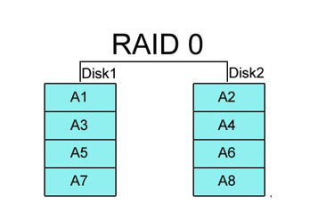
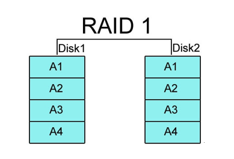
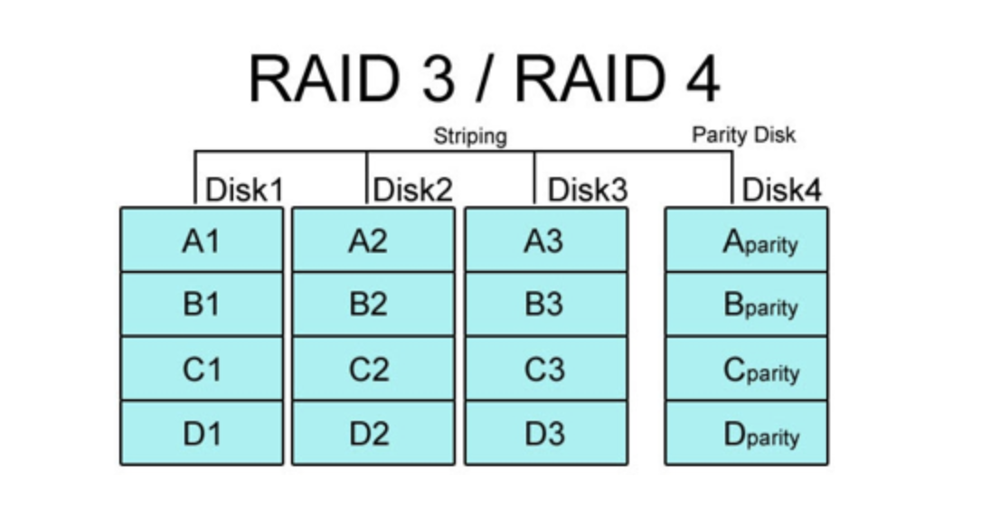
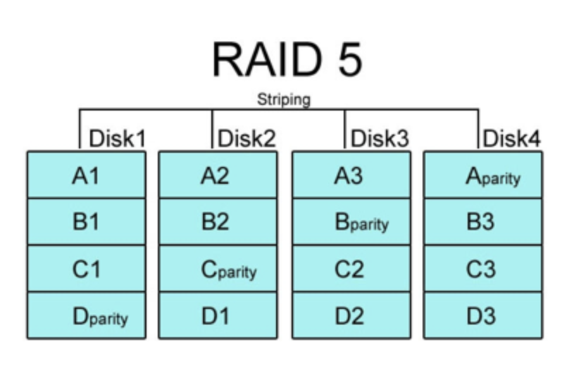
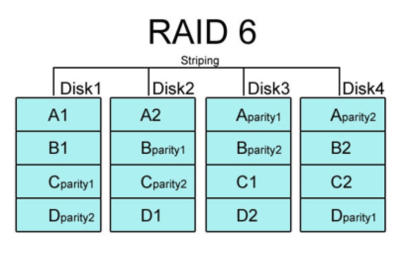

# RAID (Redundant Array of Inexpensive Disks)

> **RAID는 백엔드 면접질문에서 흔치 않게 받을 수 있는 질문이라고 생각이 된다. 그래서 따로 분리를 해서 내용을 정리해보려고 한다.**

## 정의

> **하드디스크는 영구적인 장치가 아니라는 점을 확실하게 알고 넘어가야 한다. 덮어쓰기 등의 작업이 지속적으로 이루어지면 트랙과 섹터 부분에 데미지를 줄 수 있기 때문이다.**

하드 디스크와 SSD를 사용하는 기술로, 데이터의 안전성 혹은 높은 성능을 위해서 **여러 개의 물리적인 보조기억장치를 하나의 논리적 보조기억장치처럼 사용하는 기술.**

실제로, 4TB 하드 디스크 1개를 사용하는 것 보다 1TB 하드 디스크 4개를 RAID로 구성하는 게 성능 측면에서 좋다고 한다.

 

## 기대효과

- 대용량의 단일 볼륨을 사용하는 효과
- 디스크 I/O 병렬화로 인한 성능향상
- 데이터 복제로 인한 안전성 향상

## RAID의 종류와 구성방식

### RAID 0 (Stripe 방식)

> - **여러 개의 보조기억장치에 데이터를 단순히 나눠서 저장하는 방식**

2개 이상의 디스크에 데이터를 랜덤하게 쓰는 방식이다.

저장된 데이터를 읽고 쓰는 속도가 향상된다는 장점이 있다. 하지만, 디스크들 중 하나에 문제가 발생하면 다른 모든 디스크의 정보를 읽는데 문제가 생길 수 있기 때문에 안전성 측면에서는 좋지 못하다.

#### Stripe 방식 (참고)

RAID 0은 `Stripe 방식`이라고 많이 이야기한다. 줄무늬처럼 분산되어 저장한 데이터를 Stripe 라고 하고, 분산해서 저장하는 행위를 Striping 이라고 한다.

 

### RAID 1 (Mirroring 방식)

> - 완전한 복사본을 만드는 방식

**볼륨 내의 디스크 중 하나의 디스크만 정상이어도 데이터는 보존되기 때문에 운영이 가능하다. 그래서 가용성이 높고 장애가 발생해도 복구가 쉽게 가능하다**는 장점이 있다.

하지만, **사용 가능한 용량이 작아진다는 단점**이 있다. 4개의 하드디스크를 RAID 1로 구성했다고 가정했을 때 실제로 사용할 수 있는 하드디스크는 2개이기 때문이다.

또한, **쓰기 속도가 느리다**는 단점이 있다. 원본 디스크와 복제본 디스크 두 곳 모두 작성을 하기 때문에 단일 디스크에 쓰는 것 보다는 속도가 느리다.

 

### RAID 4

> **RAID 1처럼 완전한 복사본을 만드는 대신 오류를 검출하고 복구하기 위한 패리티 비트를 구성하는 방식이다.**

RAID 0과 같이 Striping 구성을 하고 있어서 성능을 챙기고 디스크 용량을 온전히 사용할 수 있게 해주는데 **추가로, 오류를 검출하고 해결할 수 있는 패리티 정보를 별도의 디스크에 따로 저장할 수 있다.**

**다만, 어떤 새로운 데이터가 저장될 때마다 패리티를 저장하는 디스크에도 데이터를 쓰기 때문에 패리티를 저장하는 장치에 병목 현상이 발생할 수 있다는 단점이 있다.**

#### 패리티 비트 (Parity bit)

> [패리티 비트란?](https://velog.io/@octo__/%ED%8C%A8%EB%A6%AC%ED%8B%B0-%EB%B9%84%ED%8A%B8-Parity-Bit)

원래 패리티 비트는 오류 검출만 가능하고 오류 복구는 불가능하다. 하지만 RAID에서는 패리티 값으로 오류 수정이 가능하다. RAID에서만 오류 복구가 가능하다는 점을 기억하고 있자.

### RAID 5

> **RAID 4에서 별도의 패리티 비트를 저장하는 디스크를 사용하면서 발생하는 문제점을 보완하는 방식이다.**

**각 디스크에 패리티 공간을 설정하면서 패리티를 저장할 때 발생하는 병목 현상을 해소할 수 있다.**

RAID 4는 패리티를 저장하는 장치를 따로 둔다면, RAID 5는 패리티 정보를 분산하는 역할을 한다고 생각하자.

 

### RAID 6

> **RAID 5와 동일한 개념이지만 다른 드라이브들 간에 분포되어 있는 2차 패리티 정보를 넣어서 2개의 하드에 문제가 생겨도 복구할 수 있게 설계되었음.**

**서로 다른 2개의 패리티 공간을 두면서 오류를 검출하고 복구할 수 있는 수단이 2개가 생긴 셈이다.** 그래서 보다 안전한 구성이라고 할 수 있다.

**다만, 새로운 정보를 저장할 때 함께 저장할 패리티가 2개이기 때문에 쓰기 속도가 느려진다는 단점은 있다. 하지만 데이터를 더욱 안전하게 보관하고 싶을 때 사용할 수 있는 방법인 것 같다.**

---

## 참고자료

- 도서: 혼자 공부하는 컴퓨터구조와 운영체제
- https://12bme.tistory.com/286
- https://velog.io/@octo__/%ED%8C%A8%EB%A6%AC%ED%8B%B0-%EB%B9%84%ED%8A%B8-Parity-Bit
