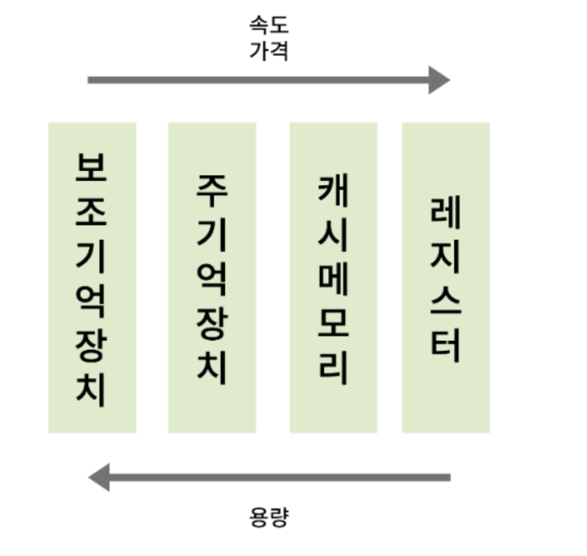
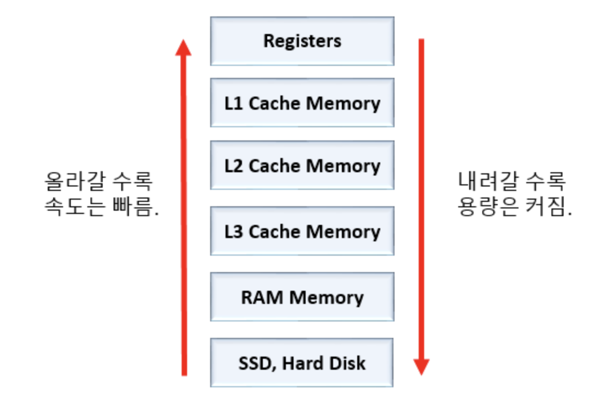

# 캐시 메모리 (Cache Memory)

CPU는 프로그램을 실행하는 과정에서 메모리에 저장된 데이터를 사용한다. 그런데 CPU가 메모리에 접근하는 시간은 CPU의 연산 속도보다 느리다. 이러한 문제를 해결하기 위해서 `캐시 메모리(Cache Memory)`를 사용한다.

## 저장 장치 계층 구조 (Memory Hierarchy)

> - CPU와 가까운 저장장치는 빠르고, 멀리 있는 장치는 느림
> - 속도가 빠른 저장장치는 저장 용량이 작고, 가격이 비싸다

## 캐시 메모리

> - **캐시 메모리는 CPU와 메모리 사이에 위치하고, 레지스터보다 용량이 크고 메모리보다 빠른 SRAM 기반의 저장장치**
> - CPU의 연산속도와 메모리 접근 속도의 차이를 조금이나마 줄이기 위해 사용된다.

데이터 요청이 들어오면 먼저 캐시에서 데이터를 탐색한다. 캐시가 없거나 오래된 경우 원본 데이터가 저장된 곳에서 데이터를 조회한다.

## Layered Cache Memory

컴퓨터 내부에는 여러 개의 캐시 메모리가 있다. 그리고 이 캐시 메모리들은 CPU(코어)와 가까운 순서대로 계층을 구성한다.
가장 가까운 캐시 메모리를 L1이라 표시하고, L3까지 있다.

### L3 Cache

- 주로 멀티코어 프로세서에서 여러 CPU 코어간에 공유되는 캐시 메모리
- 다수의 코어에서 공유되기 때문에 데이터 및 명령의 공유와 효율적인 데이터 엑세스를 제공하는 역할을 함.
- 그런데 일부 프로세서에서는 각 코어에 별도로 할당되는 L3 캐시도 있음.

## 참조 지역성의 원리

캐시 메모리는 CPU가 사용할 법한 대상을 예측해서 데이터를 저장한다. **CPU가 예측한 데이터를 가져다가 사용**하는 경우에는 `캐시 히트`라고 하며, **사용하지 않고 CPU가 직접 메모리로부터 데이터를 가져와야 하는 경우**를 `캐시 미스`라고 한다.

우리가 사용하는 컴퓨터의 캐시 적중률은 대략 85-95% 이상이다. 캐시 메모리의 이점을 살리기 위해서는 CPU가 사용할 법한 데이터를 제대로 예측해서 캐시 적중률을 높여야 하는데 CPU가 사용할 법한 데이터는 어떻게 알 수 있을까?

바로 `참조 지역성의 원리`를 바라본다. **CPU가 메모리에 접근할 때의 주된 경향을 바탕으로 만들어진 원리**다.

> - CPU는 최근에 접근했던 메모리 공간에 다시 접근하려는 경향이 있음. (시간 지역성)
> - CPU는 접근한 메모리 공간 근처를 접근하려는 경향이 있음. (공간 지역성)

---

## 참고 자료

- 도서: 혼자 공부하는 컴퓨터구조와 운영체제
- [캐시 메모리에 대해서 알아보자](https://velog.io/@wild0623/%EC%BA%90%EC%8B%9C-%EB%A9%94%EB%AA%A8%EB%A6%ACCache-Memory%EC%97%90-%EB%8C%80%ED%95%B4%EC%84%9C-%EC%95%8C%EC%95%84%EB%B3%B4%EC%9E%90)
