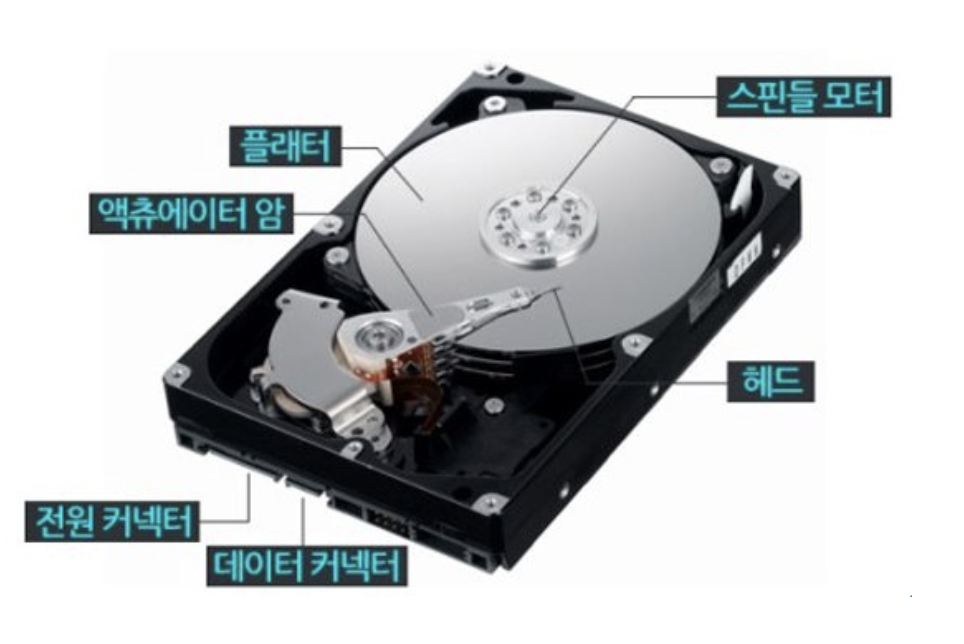
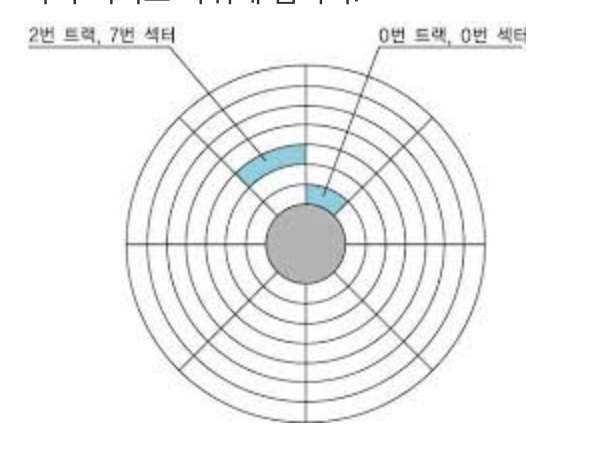

# 하드 디스크 (Hard Disk) 그리고 플래시 메모리 (Flash Memory)

> 하드 디스크의 구성이 어떻게 되어있는지, 실제로는 어떻게 동작하는지 한번 알아두면 좋을 것 같아서 따로 분리를 해서 정리를 하게 되었다.

## 하드 디스크 (Hard Disk = HDD)

> [하드디스크 구조와 작동 원리 및 각종 규격](https://whitesnake1004.tistory.com/273)

`자기적인 방식`으로 데이터를 저장하는 보조기억장치이다. 그리고 하드디스크에 존재하는 플래터를 회전시켜서 자기 패턴으로 정보를 기록한다.

### 하드디스크 구성요소

-   `플래터`: 실제로 데이터가 저장되는곳
-   `스핀들`: 플래터를 회전시켜줌 (RPM)
-   `헤드`: 저장된 데이터를 읽어주는 역할
-   `액추에이터암`: 헤드를 데이터가 있는 곳으로 옮겨주는 역할

### 트랙(Track)과 섹터(Sector)

-   `플래터`는 `트랙과 섹터`라는 단위로 데이터를 저장한다.
-   일반적으로 하나의 섹터는 512바이트 정도의 크기를 가진다.
-   보조기억장치(하드디스크)는 영구적인 제품이 아니라고 했는데, 섹터에 여러번의 Overwrite가 생기면 Bad Sector 상태가 되어 문제가 발생한다.

 

## 플래시 메모리 (Flash Memory)

> **하드디스크와 동일한 보조기억장치. 대표적으로 USB 메모리, SD 카드, SSD 등이 있다.**

**플래시 메모리는 하드디스크와는 달리 전기적으로 데이터를 읽고 쓸 수 있는 반도체 기반의 저장 장치임.** 우리가 일상적으로 접하는 거의 모든 전자 제품 안에 플래시 메모리가 내장되어 있다고 봐도 무방하다.

### 플래시 메모리의 단위와 타입

> 플래시 메모리에서는 셀(cell) 이라는 단위를 사용한다.

셀에 몇 비트를 저장할 수 있는지에 따라 `SLC, MLC, TLC` 로 나뉜다. 각각 1비트, 2비트, 3비트를 저장한다.

#### SLC 타입 (Single-Level Cell)

> -   **홀로 거주하는 집**
> -   혼자서 살면 집에서 어떠한 방해가 없이 업무를 할 수 있어서 빠르지만 감당해야 할 주거비용이 커지는 것과 같다고 생각하자.

**MLC나 TLC 보다 빠른 입출력이 가능하다. 하지만 용량 대비 가격이 높다는 단점이 있다.**

#### MLC 타입 (Multi-Level Cell)

> -   둘이서 거주하는 집
> -   한명이 사는것보다 2명이 살면 화장실을 기다려야 할 때도 있어서 나름의 방해가 있지만, 혼자 감당하지 않기 때문에 주거비용이 상대적으로 적어진다.

시중에서 사용되는 많은 플래시 메모리 저장 장치들이 MLC 또는 TLC로 구성된다.

#### TLC 타입 (Triple-Level Cell)

**SLC나 MLC 타입보다 수명과 속도가 떨어지지만 용량 대비 가격도 저렴하다.**

### 페이지의 상태

> `페이지`: 셀들이 모여져서 만들어진 단위

플래시 메모리에서 읽기와 쓰기는 페이지 단위로 이루어진다. 하지만 삭제는 페이지보다 더 큰 단위인 `블록` 단위로 이루어진다.

그래서 **읽기/쓰기 단위와 삭제 단위가 다르다는 것이 플래시 메모리의 가장 큰 특징**이다.

-   Free 상태: 어떠한 데이터도 저장하고 있지 않아서 신규 데이터 유입 가능
-   Valid 상태: 이미 유효한 데이터를 저장하고 있는 상태
-   Invalid 상태: `쓰레기값` 이라 부르는 유효하지 않은 데이터를 저장하고 있는 상태

**참고로, 플래시 메모리는 하드디스크와 달리 Overwrite가 불가능해서 Valid 상태는 페이지에서 새 데이터를 저장할 수 없다.**

기존에 저장된 페이지가 Invalid 상태가 되어서 쓰레기값이 되고, 새로운 데이터가 저장된다.

### 플래시 메모리에서의 가비지 컬렉션 (Garbage Collection)

쓰레기값을 저장하고 있는 공간은 사용하지 않을 공간인데 공간 차지가 되고 있어서 용량 낭비이다. 그렇지만, 특정 데이터만 지울수는 없다. 왜냐하면 삭제 단위는 블록 기반이기 때문이다.

그래서 플래시 메모리는 이런 쓰레기값을 정리하기 위해서 가비지 컬렉션 기능을 제공한다.

**유효한 페이지들만을 새로운 블록으로 이동시키고, 기존의 블록을 삭제하는 과정을 거친다.**
