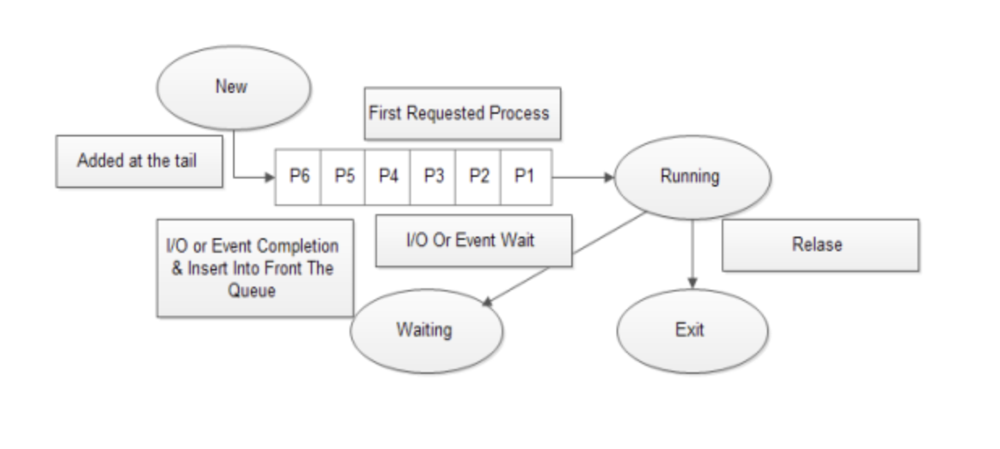
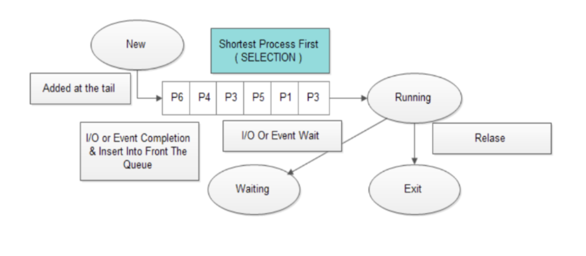

# CPU 스케줄링

> CPU 스케줄링에 대해서 핵심 부분을 정리하려고 한다.

## 정의

-   **운영체제가 CPU의 자원을 어떤 프로세스에게 할당해 줄 지 그 일정을 짜는 것**이다.
-   **프로세스 간의 Context-Switching 과정은 많은 자원 손실이 있다. 그래서 이 일정을 어떻게 짰는지에 따라 CPU의 자원을 얼마나 효율적으로 사용하게 되는지가 결정된다.**

## 스케줄링 큐 (Scheduling Queue)

> **많은 프로세스들이 한정된 CPU 자원에 접근하려고 한다. 운영체제는 이 프로세스들한테 줄을 서서 기다리라고 한다. 운영체제는 이 줄을 스케줄링 큐로 구현하고 관리한다.**

-   운영체제는 메모리로 적재되고 싶은 프로세스들을 큐에 삽입하고 줄을 세우고, CPU를 이용하고 싶은 프로세스들 또한 큐에 삽입하여 줄을 세운다.
-   `준비 큐(ready queue)`: CPU를 이용하고 싶은 프로세스들이 서는 줄
-   `대기 큐(waiting queue)`: 입출력장치를 이용하기 위해 대기 상태에 접어든 프로세스들이 서는 줄

## 선점형과 비선점형 스케줄링

-   `선점형`: 강제로 빼앗아 다른 프로세스에 할당할 수 있는 스케줄링 방식
-   `비선점형`: 선점하고 있는 프로세스가 끝날 때까지 기다렸다가 사용하는 방식

### 선점형 스케줄링

#### FCFS (First-Come-First-Served Scheduling)

> **프로세스가 Ready Queue에 도착한 순서대로 CPU에 할당하는 방식**

-   작업 완료 시간을 예측하기 용이하다.
-   **그렇지만, CPU 처리 시간이 길지만 덜 중요한 작업이, CPU 처리 시간이 짧고 더 중요한 작업을 기다리게 할 수 있다.**
-   `호위 상태(Convoy Effect)`

#### SJF (Shortest-Job-First Scheduling)

> **프로세스를 CPU 처리 시간이 짧은 순서대로 CPU에 할당하는 방식**

-   모든 방식을 통틀어 평균 대기 시간을 가장 짧게 만드는 방식으로 알려져있음.
-   그런데 CPU 처리 시간이 긴 프로세스는 전체 시스템 성능 향상을 위해 희생하면서 계속 Ready-Queue의 뒤로 밀려나기 때문에 무한정 기다려야 하는 상황이 발생할 수 있다.
-   `기아 상태 (Starvation)`
