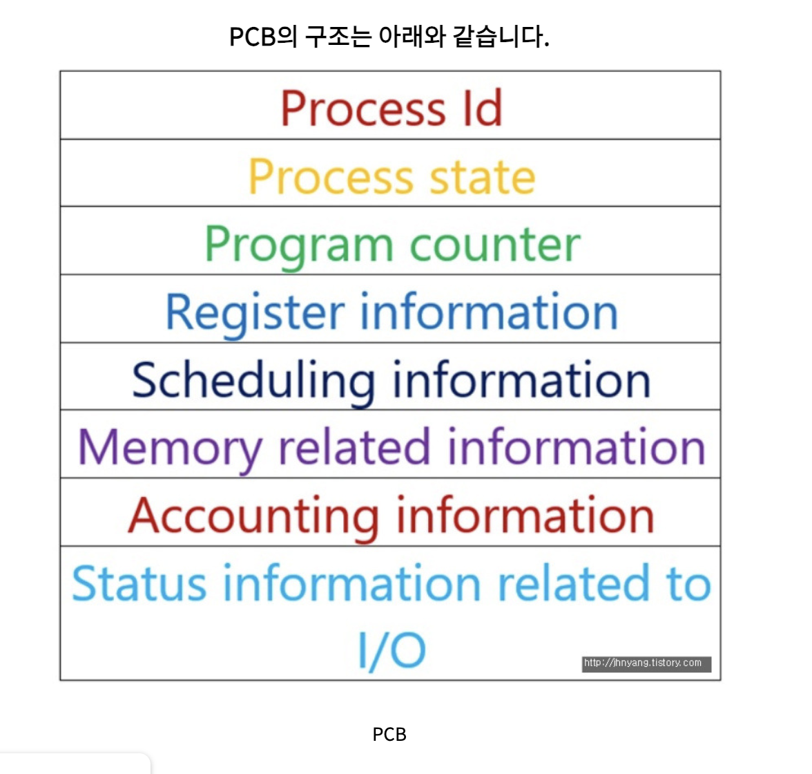
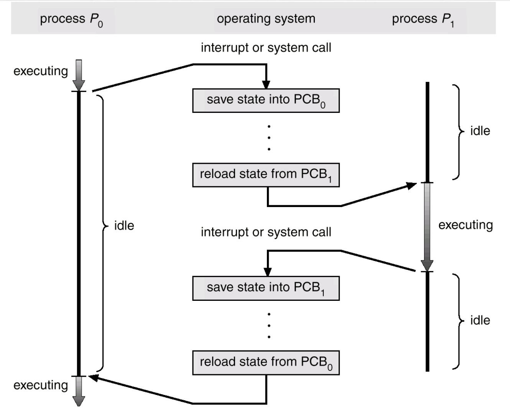

# PCB(Process-Control Block)와 문맥 교환(Context-Switching)

> 이번 글에서는 Context-Switching과 PCB에 대해서 정리를 해보려고 한다.

## PCB (Process-Control Block)

### 정의

모든 프로세스는 실행을 위해서 CPU를 필요로 하지만 CPU 라는 자원은 한정된 자원이다. 다시 말해서, 모든 프로세스는 CPU를 동시에 사용할 수 없다. 
운영체제는 빠르게 번갈아서 수행되는 프로세스의 실행 순서를 관리하고, 프로세스에 CPU를 비롯한 자원을 배분한다. 이를 위해서 운영체제는 `프로세스 제어 블록`을 이용한다.

PCB는 프로세스와 관련된 정보를 저장하는 자료구조이다. 상품에 달려있는 태그와 같다고 생각하자. 
그리고, PCB는 유저 영역과 커널 영역에서 커널 영역에 생성된다. 
프로세스 생성 시에 만들어지고, 실행이 끝나면 폐기된다.

### PCB에 기록되는 요소

-   `프로세스ID (PID)`
-   `레지스터값`: 자신의 실행차례가 돌아오면 이전까지 사용했던 레지스터의 중간값들을 복원해야 이전까지 진행했던 작업을 이어서 실행할 수 있다.
-   `프로세스 상태`: 생성,준비,실행,대기,종료
-   `CPU 스케줄링 정보`: 프로세스가 언제, 어떤 순서로 CPU를 할당받을지에 대한 정보
-   `메모리 관리 정보`: 프로세스마다 메모리에 저장된 위치가 다르기 때문에 기록해야 한다.
-   `사용한 파일과 입출력장치 목록`

 

## Context-Switching

### 정의

멀티 프로세스 환경에서 CPU가 하나의 프로세스를 실행하고 있는 상태에서 인터럽트 요청에 의해 다음 우선 순위의 프로세스가 실행되어야 할 때 **기존의 프로세스의 상태 또는 레지스터값(context)을 저장하고 CPU가 다음 프로세스를 수행하도록 새로운 프로세스의 상태 또는 레지스터값(context)를 교체하는 작업**을 `Context-Switching` 이라고 한다.

### 동작 과정

-   `P0`이 실행되고 있기 때문에 CPU 내부의 레지스터 안에는 P0의 정보가 저장이 된 상태로 실행되고 있을 것이다.
-   실행 도중 `인터럽트 또는 시스템 콜 요청`이 들어와서 **운영체제는 P0의 정보를 PCB_0에 저장한다.**
-   P0이 Idle 상태가 되면 CPU는 P1을 Running 상태로 변경한다. 이 과정에서 레지스터 안에 저장된 값도 P1과 관련된 정보로 교체를 해야한다.
-   이 때, P0의 정보를 어딘가에는 저장해야 하는데 그 값들이 PCB 라는 자료구조에 저장되는 것이다.
-   정리하자면, `Context-Switching` 이란 **이전에 실행 중이던 프로세스 상태 및 정보를 PCB에 저장하고, 다음에 실행할 프로세스의 상태와 정보를 PCB에서 읽어서 레지스터에 옮기는 과정이라고 할 수 있다.**

### Context-Switching의 한계점

-   Context-Switching 시 해당 CPU는 아무런 작업을 할 수 없다. 그래서 Context-Switching이 빈번하게 이루어지면 Overhead가 발생해서 효율을 떨어뜨릴 수 있다.
-   그렇지만, Overhead를 감수하면서 Context Switching을 작동시키는 것이 CPU를 가장 효율적으로 사용하는 방법이라고 할 수 있다.

### Context는 뭐야?

> **사용자와 다른 사용자, 사용자와 시스템 또는 디바이스간의 상호작용에 영향을 미치는 사람, 장소, 개체등의 현재 상황(상태)을 규정하는 정보들**

-   OS 레벨에서의 Context는 **CPU가 해당 프로세스를 실행하기 위한 해당 프로세스의 정보들이다.**
-   Context는 `프로세스의 PCB(Process-Control Block)`에 저장된다.
-   그래서 Context-Switching 때 PCB의 정보를 읽어서 CPU가 전에 프로세스가 일을 하던 것에서 이어서 수행이 가능한 것이다.

 

## 인터럽트(Interrupt)

> -   **쉽게 말해서 선생님이 수업하는 도중 학생이 질문하는 것이라고 생각하자**

-   즉, CPU의 정상적인 프로그램 실행을 방해했다는 의미이다.
-   선생님은 학생의 질문에 대한 답변을 해주고 다시 원래 하던 수업을 이어서 하실 것이다.
-   크게 `내부 인터럽트`와 `외부 인터럽트`로 나눌 수 있다.

### Context-Switching 에서의 인터럽트

어떤 인터럽트 요청이 들어오면 Context-Switching이 발생할까?

`I/O Request(입출력요청)`, `Time-Slice Expired(CPU 사용시간 만료)`, `Fork a child(자식 프로세스 생성)`, `Wait for an interrupt(인터럽트 대기)` 등이 있다. 
이 외에도 많은 인터럽트가 있을 것이다.

---

## 참고자료

-   https://jeong-pro.tistory.com/93
-   https://whatisthenext.tistory.com/147
-   https://resilient-923.tistory.com/217
-   https://velog.io/@adam2/%EC%9D%B8%ED%84%B0%EB%9F%BD%ED%8A%B8
