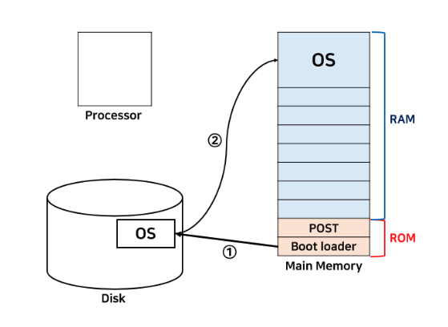
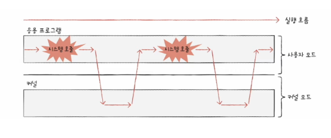
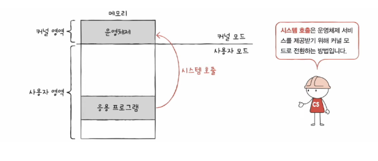

# 운영체제와 이중모드

> 이번 글에서는 운영체제와, User Mode/Kernel Mode에 대해서 정리하려고 한다.

운영체제(Operating System)은 사용자가 컴퓨터를 사용하기 위해 필요한 소프트웨어이다. 조금 전문적으로 정리해보면, **"하드웨어 자원을 관리하고 응용 프로그램과 하드웨어 사이를 중재하는 인터페이스"를 의미한다.**

## 운영체제의 목적

운영체제를 사용하는 가장 주된 목적은 `컴퓨터와 하드웨어 관리` 이다. CPU, 메모리, 마우스 모니터 등을 잘 관리해야 컴퓨터를 효율적으로 사용할 수 있다. 그리고 운영체제는 `사용자에게 편의를 제공` 하는 목적도 가지고 있다. 만약 운영체제가 없었다면 하드웨어에 관한 모든 관리를 사용자가 해야한다는 점과 같이 컴퓨터를 사용하는데 매우 불편함을 겪을 것이다.

**즉, 운영체제는 컴퓨터의 성능을 높이고, 사용자에게 편의성을 제공하는 것을 목적으로 하는 컴퓨터 하드웨어 관리하는 프로그램이다.**

## 부팅



> -   Processor는 일반적으로 CPU를 의미한다.
> -   메인 메모리는 크게 ROM과 RAM으로 나눠진다.
> -   ROM은 비휘발성으로 메모리에서 극히 일부를 차지한다.
> -   RAM은 휘발성으로 메모리의 대부분을 차지하고 실제 프로그램이 할당되는 곳이다.

컴퓨터의 전원이 켜지면 CPU에서 ROM에 있는 내용을 읽는다. 대표적으로 ROM에는 POST(Power-On-Self-Test) 프로그램과 부트 로더(Boot Loader)가 저장되어 있다.<br/>
POST는 전원이 켜지면 가장 처음에 실행되는 프로그램으로 현재 컴퓨터의 상태를 검사한다. POST 작업이 끝나면 부트 로더가 실행된다.<br/>
부트 로더는 하드디스크에 저장되어 있는 운영체제를 찾아서 메인 메모리에 가지고 오는데 이런 과정을 `부팅` 이라고 한다.

<br/>

## 커널(Kernel)

> https://minkwon4.tistory.com/295

-   운영체제 중 항상 메모리에 올라가 있는 운영체제의 핵심 부분이다.
-   하드웨어와 응용 프로그램 사이에서 인터페이스를 제공하는 역할을 하고 컴퓨터 자원들을 관리하는 역할
-   다만, 커널은 항상 컴퓨터 자원을 바라보고 있기 때문에 사용자와의 상호작용을 지원하지 않는다.
-   사용자와의 직접적인 상호작용을 위해서 `Shell` 이라는 프로그램을 제공한다. (GUI와 CLI) (리눅스에서는 주로 Bash를 사용함)

<br/>

## 운영체제의 위치

-   사용자 프로그램은 특정 운영체제에 맞춰서 만든다. 그래서 하나의 애플리케이션은 서로 다른 운영체제에서 수행할 수 없다.
-   애플리케이션은 운영체제 위에서 수행한다. 하드웨어 자원을 직접적으로 사용하지 않고 **운영체제가 제공하는 자원만 사용할 수 있다.**

운영체제는 다음과 같은 일을 한다.

-   프로세스, 메모리, 하드디스크 등 하드웨어 자원이 존재하고 이를 효율적으로 사용해야함.
-   자원 관리를 위해 프로세스 관리, 메모리 관리, 디스크 관리, 네트워크, 보안 등 기능이 나눠져 있다.
-   애플리케이션들의 요청에 따라 각 기능들이 수행해서 적절히 자원을 분배한다.

<br/>

## 이중 모드(유저 영역과 커널 영역)

하나의 컴퓨터 내에서 여러 프로그램을 수행하는 것은 일반적인데, 특정 컴퓨터나 프로그램에서 잘못된 동작으로 인해 다른 컴퓨터가 영향을 받는다면 위험하다.<br/>
이런 문제점을 해결하기 위해서 일반 사용자가 치명적인 명령어들을 요청하는 것을 막기 위해 `이중 모드`가 나왔다.



-   Kernel Mode: 운영체제가 지원하는 함수를 실행할 수 있는 명령어 실행 모드 (fork, exit, open 등)
-   User Mode: 운영체제가 지원하는 함수를 실행할 수 없는 명령어 실행 모드

### 실제 동작 에시

```c
#include <unistd.h>
#include <sys/types.h>
#include <sys/stat.h>
#include <fcntl.h>

// 1단계
int main(){
	// 2단계 ~ 5단계
	int fd = open("data.txt", O_READ_ONLY);

	// 6단계, 7단계
	if(fd == -1){
		printf("Error!! 파일 열기 실패");
		return -1;
	}else{
		printf("파일 열기 성공!");
		close(fd);
		return 1;
	}
}
```

-   1단계: 사용자 모드에서 응용 프로그램 실행
-   2단계: open 함수를 사용하면 시스템 콜을 호출해서 하드웨어의 파일을 읽어와 달라고 요청
-   3단계: 운영체제는 커널 모드로 전환
-   4단계: 운영체제는 파일 열기 함수를 처리하는 sys_open() 이란 커널 함수를 호출
-   5단계: CPU에서 파일 열기 연산 수행
-   6단계: 응용 프로그램에게 파일 열기 결과값 전달 후 사용자 모드로 전환
-   7단계: open 함수 이후의 코드(프로그램) 계속해서 실행

<br/>

## 시스템 콜



-   프로그램 실행 중 유저 모드에서 커널 모드로 전환해서 서비스를 요청하는 것이다.
-   `소프트웨어 인터럽트`의 일종이다.
-   커널 영역의 코드를 실행하는 것이라고 생각하면 된다.
-   일반적인 함수 호출은 프로그램 자신의 스택 영역을 사용하는 것임에 비해, 시스템 콜은 커널 영역의 함수 위치로 점프를 하는 방식이다. C언어의 printf나 scanf도 내부적으로 시스템 콜을 통해 실행된다.

<br/>

## 운영체제 서비스

> -   운영체제의 핵심 서비스는 `프로세스 관리`, `자원 접근 및 할당`, `파일 시스템 관리`이다.
> -   이 외에도 다양한 서비스를 제공한다.

### 프로세스 관리

-   운영체제는 다양한 프로세스를 관리하고 실행할 수 있어야 한다.
-   여러 프로세스가 한정된 CPU 자원에 효율적으로 접근할 수 있도록 운영체제가 관리한다.
-   프로세스 생성 및 소멸, IPC, Synchronization, DeadLock Handling 등

### 주기억장치 관리

-   주기억장치(메인메모리)는 프로그램이 실행되기 위한 공간이다. CPU는 오직 메인 메모리에 있는 프로그램과 소통할 수 있다.
-   프로세스에게 메모리 공간 할당 및 회수, 추적 및 감시, 효율적인 메모리 사용 등의 작업을 수행한다.

### 파일 시스템 관리

-   디스크는 물리적으로 Track과 Sector로 구성되어 있고, 파일이라는 논리적 관점으로 데이터를 바라보고 관리한다
-   복잡한 과정으로 하드디스크에 저장되어 있는 것을 사용자가 편리하게 사용할 수 있도록 파일이라는 논리적 형태로 운영체제에서 관리해서 보여준다.
-   파일 생성/삭제, 파일 열기/읽기/쓰기 등

### 보조기억장치 관리

대표적으로 하드 디스크와 플래시 메모리가 있다. 운영체제는 보조기억장치를 관리한다.<br/>
`빈공간관리`, `저장공간 할당`, `디스크 스케줄링` 등의 작업을 수행한다.

### 입출력장치 관리

키보드, 마우스, 스피커 등의 장치들을 관리한다.<br/>
`장치 드라이브` 세팅을 수행하고, 버퍼링이나 캐싱 등 입출력 장치의 성능을 향상시키는 작업을 한다.

---

## 참고자료

-   https://minkwon4.tistory.com/295
-   https://jerryjerryjerry.tistory.com/177
-   https://fjvbn2003.tistory.com/306
-   https://velog.io/@heyksw/CS-%EC%9A%B4%EC%98%81%EC%B2%B4%EC%A0%9C-pf3026ep
