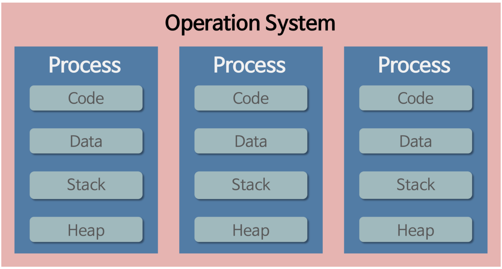
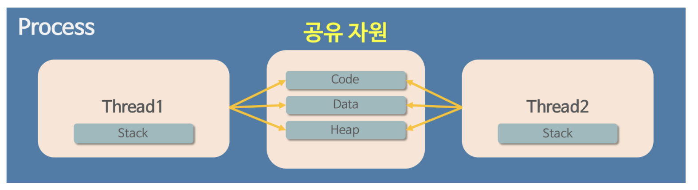

# 프로세스와 스레드

> **해당 문서에서는 프로세스와 스레드가 무엇인지에 대해서 조금 상세하게 정리해보려고 한다.**

## 프로그램과 프로세스, 스레드

> -   `프로그램(Program)`: 파일이 저장 장치에 저장되어 있지만 메모리에는 올라가지 않은 정적인 상태
> -   `프로세스(Process)`: 운영체제로부터 자원을 할당받은 `작업`의 단위
> -   `스레드(Thread)`: 프로세스가 할당받은 자원을 이용하는 `실행 흐름`의 단위

### 프로그램(Program)

프로그램은 **아직 실행되지 않은 파일 자체를 가리키는 말**이다. 대표적으로는 **윈도우의 exe 파일이나 mac의 dmg 파일** 등 사용자가 눌러서 실행하기 전의 파일을 말한다. 
쉽게 말하면 `코드 덩어리`라고 할 수 있다.

위의 설명에서 `"메모리에는 올라가지 않은"` 이라는 말은 아직 운영체제가 프로그램에게 독립적인 메모리 공간을 할당하지 않았다는 의미이다. 모든 프로그램은 운영체제가 프로그램이 실행되기 위한 메모리 공간을 할당해줘야 실행될 수 있기 때문이다.

### 프로세스(Process)

해당 프로그램을 더블클릭해서 실행하면 해당 프로그램은 컴퓨터의 메모리에 올라가게 된다. 이 상태를 `프로세스` 라고 한다. 
한 마디로 정리하자면 `실행되고 있는 컴퓨터 프로그램` 이라고 정리할 수 있다.

### 스레드(Thread)

과거에는 프로그램을 실행할 때 실행 시작부터 실행 끝까지 프로세스 하나만을 사용해서 진행했다고 한다. 하지만 시간이 지나면 지날수록 프로그램이 복잡해지고 프로세스 하나만을 사용해서 프로그램을 실행시키기에는 벅차는 것이다. 
그리고 최근 프로그램들은 단순히 한 가지 작업만 하지는 않는다.

그러면 한 프로그램을 처리하기 위한 프로세스를 여러개 만드는 건 안될까? 라는 생각이 들 수 있지만, 운영체제는 안전성을 위해서 프로세스마다 자신에게 할당된 메모리 내의 정보에만 접근할 수 있도록 제약을 두고 있기 때문이다. 
그래서 프로세스 보다 더 작은 실행 단위 개념이 필요했고, 해당 개념이 `스레드`이다.

스레드는 프로세스의 다르게 **스레드 간 메모리를 공유**하면서 작동한다. **스레드끼리는 프로세스의 자원을 공유하면서 프로세스 실행 흐름의 일부가 되는 것이다.**

 

## 프로세스와 스레드의 작동 방식 (프로세스의 메모리 영역)

> -   **운영체제는 프로세스마다 각각 독립된 메모리 영역을 `Code(코드영역) / Data(데이터영역) / Stack(스택영역) / Heap(힙영역)` 으로 나눠서 할당해준다.**
> -   참고로, 프로세스가 생성되면 커널 영역에 PCB가 생성되고, `사용자 영역`에는 Code/Data/Stack/Heap 영역으로 나뉘어 저장된다.

운영체제는 프로세스에게 각각 독립된 메모리 영역을 할당해 주기 때문에 프로세스는 다른 프로세스의 변수나 자료에 접근할 수 없다. 하지만 위에서 스레드는 메모리를 서로 공유할 수 있다고 했다. 
프로세스가 할당받은 메모리 영역 내에서 Stack 형식으로 할당된 메모리 영역은 따로 할당받고, 나머지 Code, Data, Heap 형식으로 할당된 메모리 영역을 공유한다. 그래서 각 스레드는 별도의 스택을 가지고 있지만 힙 메모리는 서로 읽고 쓸 수 있게 된다.

### 프로세스와 스레드의 한계점

-   한 프로세스를 실행하다가 오류가 발생해서 프로세스가 강제로 종료되어도, 다른 프로세스에게는 영향이 없다.
-   하지만, 스레드는 Code, Data, Heap 메모리 영역을 공유하기 때문에 특정 스레드에서 오류가 발생한다면 같은 프로세스 내의 다른 스레드 모두가 종료된다.

### 각 영역에 대한 설명

#### 코드 영역

-   실행할 수 있는 코드, 즉 기계어로 이루어진 명령어가 저장된다.
-   데이터가 아닌 CPU가 실행할 명령어가 담겨 있기 때문에 쓰기가 금지되어 있다 (read-only)

#### 데이터 영역

-   프로그램이 실행되는 동안 유지할 데이터가 저장되는 공간
-   대표적으로 전역변수가 있다.

#### 힙 영역

-   프로그래머가 직접 할당할 수 있는 공간
-   C언어에서의 malloc과 같이 메모리를 할당할 수 있는 함수 -> 꼭 free를 통해 메모리 반환을 해주어야 한다.
-   반환을 해주지 않으면 메모리 내에 계속 남아서 메모리 낭비를 초래한다 -> `메모리 누수(memory leak)`

#### 스택 영역

-   데이터를 일시적으로 저장하는 공간
-   대표적으로 지역변수, 매개변수가 있다.

### 스레드는 최소 작업 단위?

위에서 스레드는 흐름의 단위라고 표시했는데, 잘 이해가 되지 않았었다. 조금 더 이해하기 쉽게 정리해보자면 `CPU 입장에서의 최소 작업 단위` 이다. 
**CPU는 작업을 처리할 때 스레드를 최소 단위로 삼고 작업을 한다는 것**이다.

하지만, 운영체제는 스레드 라는 최소 단위까지 고려하지 못하고, **프로세스를 최소 작업 단위로 간주하고 작업을 처리**한다. 
하나의 프로세스는 하나 이상의 스레드를 가질 수 있다. 운영체제는 프로세스가 작업의 최소 단위이기 때문에 같은 프로세스 소속의 스레드들끼리 메모리를 공유하지 않을 수 없다.

 

## 멀티 프로세스 (Multi-Process)

운영체제에서 하나의 응용 프로그램에 대해 동시에 여러 개의 프로세스를 실행할 수 있게 하는 기술이다. (동시에 실행하는 것처럼 보이지만 실제로는 동시에 실행하지는 않는다)

멀티 프로세스 구조는 하나의 부모 프로세스가 여러 개의 자식 프로세스를 생성(fork)함으로서 다중 프로세스를 구성하는 구조이다. 
하나의 프로세스는 실행되는 도중 프로세스 생성 시스템 콜을 통해 새로운 프로세스들을 생성할 수 있다. (부모-자식 프로세스 구조)

부모 프로세스와 자식 프로세스는 서로 통신이 가능하지만 엄연히 서로 다른 프로세스로 독립적으로 실행된다. 그리고 독립적으로 메모리 공간을 가지고 있어서 서로 다른 작업을 수행한다. **대표적인 예로 브라우저 상단 탭이나 새 창을 들 수 있다.** (브라우저 프로그램 -> 각 브라우저 탭)

그래서 하나의 브라우저 탭에서 먹통이 되어도 다른 탭에서는 정상적으로 동작하는 것을 확인할 수 있는데 이는 각 탭이 독립된 프로세스이기 때문이다.

### Pros and Cons

#### 장점

-   `프로그램 안전성`: 각 프로세스가 독립적인 메모리 공간을 가지고 있어서 하나의 프로세스가 비정상적으로 종료되어도 다른 프로세스는 영향을 받지 않음
-   `프로그램 병렬성`: 멀티 프로세스와 여러 개의 CPU 코어를 활용해서 둘의 시너지를 합쳐서 다중 CPU 시스템에서 각 프로세스를 병렬적으로 실행해서 성능을 향상시킬 수 있다.
-   `시스템 확장성`: 멀티 프로세스는 각 프로세스가 독립적이기 때문에 새로운 기능이나 모듈을 추가하거나 수정할 때 다른 프로세스에 영향을 주지 않아서 시스템의 규모를 쉽게 확장할 수 있다. **대표적으로 PM2를 활용해서 하나의 컴퓨터에 여러 개의 서버 프로세스를 띄우는 것을 의미한다.**

#### 단점

-   `Context Switching Overhead`
-   `자원 공유 비효율성`: 멀티 프로세스는 각 프로세스가 독립적인 메모리 공간을 가져서 결과적으로 메모리 사용량이 증가함. 프로세스 끼리의 자원 공유를 위해서는 IPC 기법을 사용해야 하는데, IPC 자체로 오버헤드가 발생한다. (파이프, 소켓, Message Queue 등)

 

## 멀티 스레드 (Multi-Thread)

멀티 스레드는 하나의 프로세스 안에 여러 개의 스레드가 있는 것을 의미한다. 그래서 하나의 프로그램에서 2가지 이상의 동작을 동시에 처리하도록 하는 행위가 가능해진다. 
웹 서버는 대표적인 멀티 스레드 응용 프로그램이다. 사용자가 서버 데이터베이스에 자료를 요청하는 동안 브라우저의 다른 기능을 이용할 수 있는 이유도 멀티 스레드 기능 때문이다.

**멀티 프로세스는 웹 브라우저에서의 여러 탭이나 여러 창이라고 했다. 그렇지만 멀티 스레드는 웹 브라우저의 단일 탭 또는 창 내에서 브라우저 이벤트 루프, 네트워크 처리, I/O 및 기타 작업을 관리하고 처리하는데 사용된다.**

### Pros and Cons

#### Pros

> 윈도우, 리눅스 등 많은 운영체제들이 멀티 프로세싱을 지원하고 있지만 멀티 스레딩을 기본으로 하고 있다.

-   `스레드는 프로세스보다 가벼움`
-   `자원의 효율성`: 프로세스와 달리 IPC를 사용하지 않고도 데이터를 공유할 수 있다.
-   `Context Switching 비용 감소`: 스레드에도 컨텍스트 스위칭 오버헤드가 발생하는데, 상대적으로 프로세스 컨텍스트 스위칭보다 오버헤드가 훨씬 낮다.
    -   프로세스는 CPU 캐시에 있는 내용을 초기화하고 새로운 프로세스 정보를 적재해야 해서 비용이 높다.
    -   스레드는 스레드 간에 공유하는 자원을 제외한 스레드 정보(stack, register) 만 교체하면 되어서 비용이 상대적으로 낮다.
-   `응답 시간 단축`

#### Cons

-   `안전성 문제` -> 프로그래머의 역량에 따라 극복 가능
-   `동기화로 인한 성능 저하`: 여러 개의 스레드가 공유 자원에 동시에 접근할 수 있어서 동기화 문제가 발생할 수 있음.
-   `데드락(교착상태)`
-   `Context Switching Overhead`
-   `디버깅이 어려움`

 

---

## 참고자료

-   [프로세스와 스레드의 차이](https://velog.io/@raejoonee/%ED%94%84%EB%A1%9C%EC%84%B8%EC%8A%A4%EC%99%80-%EC%8A%A4%EB%A0%88%EB%93%9C%EC%9D%98-%EC%B0%A8%EC%9D%B4)
-   [멀티 프로세스 vs 멀티 스레드 비교](https://inpa.tistory.com/entry/%F0%9F%91%A9%E2%80%8D%F0%9F%92%BB-multi-process-multi-thread)
