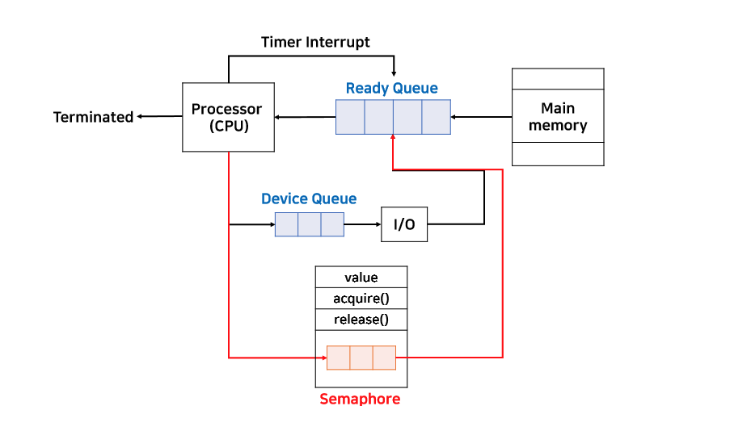

# 동기화 기법

> -   특정 시간에 한 좌석의 기차표는 반드시 하나만 존재한다. 그런데 해당 좌석을 예매하려는 사용자(프로세스)는 여러명이다.
> -   만약 동기화 문제가 발생한다고 가정했을 때, 이 사용자들이 동시에 하나의 좌석 기차표를 구매하려고 하면 하나의 기차표를 여러 사람이 예매하는 이슈가 발생할 수 있다.
> -   즉, **프로세스 동기화는 여러 프로세스가 공유하는 자원의 일관성을 유지하는 것이다. 이는 프로세스들 사이의 수행 시기를 맞추는 것이다!**
> -   **동기화는 실행 순서 제어(파일 읽고 쓰기)를 위한 동기화가 있고, 상호 배제(은행 입출금)를 위한 동기화가 있다.**

## 은행 계좌 예제

```java
class BankAccount {
    public int balance;

    // 입금
    public void deposit(int amount) {
        balance = balance + amount;
    }

    // 출금
    public void withdraw(int amount) {
        balance = balance - amount;
    }

    public int getBalance() {
        return balance;
    }
}

class Parent extends Thread {
    BankAccount b;
    Parent(BankAccount b) {
        this.b = b;
    }

    public void run() {
        for (int i = 0; i < 100; i++) {
            b.deposit(1000);
        }
    }
}

class Child extends Thread {
    BankAccount b;
    Child(BankAccount b) {
        this.b = b;
    }

    public void run() {
        for (int i = 0; i < 100; i++) {
            b.withdraw(1000);
        }
    }
}

class Test {
    public static void main(String[] args) {
        BankAccount b = new BankAccount();
        Parent p = new Parent(b);
        Child c = new Child(b);

        p.start();   // 스레드 실행
        c.start();

        p.join();   // 스레드가 끝나기를 기다리는 메서드
        c.join();

        System.out.println("최종 잔액: " + b.getBalance());
    }
}
```

위의 코드를 실행시키면 당연히 `balance`는 0이 출력되어야 할 것이다.<br/>
매우 간단한 코드이고, 2개의 스레드만 동작하고 있기 때문에 동기화 문제가 발생할 확률은 많이 낮다.<br/>
문제를 확인하기 위해서는 시간 지연을 시켜보도록 하자.

```java
public class BankAccount {
    public int balance;

    public void deposit(int amount) {
        int temp = balance + amount;
        System.out.println("+");
        balance = temp;
    }

    public void withdraw(int amount) {
        int temp = balance - amount;
        System.out.println("-");
        balance = temp;
    }

    public int getBalance() {
        return balance;
    }
}
```

-   위의 코드를 실행시켜보면 결과값이 0이 아닌 다른 값이 나온다.
-   동기화 문제를 해결하지 못했기 때문에 발생하는 문제이다. 문제가 발생하는 원인은 **공통변수에 대한 동시 업데이트** 때문이다.
-   이러한 공통변수 구역을 `임계구역(Critical Section)` 이라고 한다.

<br/>

## 임계구역(Critical Section) 문제 + Race Condition

> 임계구역은 여러 개의 쓰레드가 수행되는 시스템에서 각 쓰레드들이 공유하는 데이터(변수, 테이블 등)를 변경하는 코드 영역을 의미한다.

```java
public void deposit(int amount) {
        balance = balance + amount;
    }

    public void withdraw(int amount) {
        balance = balance - amount;
    }
```

-   위 코드 부분이 임계구역 이라고 할 수 있다.
-   임계구역 문제를 해결하기 위해서는 `Mutual Exclusion`, `Progress`, `Bounded Waiting` 조건을 만족해야 한다.
    -   `Mutual Exclusion(상호배제)`: 단 하나의 스레드만 진입이 가능하다. 한 스레드가 임계구역에서 수행 중인 상태에서는 다른 스레드는 임계 구역에 접근할 수 없다.
    -   `Progress(진행)`: 임계구역에 어떠한 프로세스(스레드)가 진입하지 않았다면 임계 구역에 진입하고자 하는 프로세스는 들어갈 수 있어야 한다.
    -   `Bounded Waiting(유한 대기)`: 하나의 프로세스가 임계 구역에 진입하고 싶다면 그 프로세스는 언젠가는 임계 구역에 들어갈 수 있어야 한다.
-   **만약, 잘못된 실행으로 인해 여러 프로세스가 동시 다발적으로 임계 구역의 코드를 실행해서 문제가 발생하면? -> Race Condition!**

### 프로세스 및 스레드 동기화

목적은 다음과 같다.

-   원하는 결과값을 도출하도록 임계구역 문제를 해결함
-   프로세스의 실행 순서를 원하는대로 제어한다.
-   Busy-wait 등과 같은 비효율성을 제거한다. (`Busy-wait`: 특정 조건을 만족할 때 까지 다른 작업을 수행하지 않고 기다리는 것)

<br/>

## 뮤텍스 락 (Mutex Lock)

> -   상호 배제를 위한 동기화 도구
> -   탈의실에서의 자물쇠 도구

임계 구역에 진입하는 프로세스는 "내가 지금 임계 구역에 있음"을 알리기 위해서 뮤텍스 락을 활용해서 임계 구역에 자물쇠(lock)을 걸어둘 수 있음.

그리고 다른 프로세스는 임계 구역이 잠겨 있으면 기다리고, 잠겨 있지 않다면 임계 구역에 진입할 수 있는 것이다.

```
// 임계 구역을 잠그는 역할
// 임계 구역에 진입하기 전에 호출하는 함수
acquire() {
    while (lock == true)   // lock이 false가 될 때까지 물어봄
    ;
    lock = true;   // 임계 구역이 열려있다면 닫는 역할
}

// 임계 구역에서의 작업이 끝나고 호출되는 함수
// 현재 잠긴 임계 구역을 열어주는 함수
release() {
    lock = false;
}
```

<br/>

## Semaphore (세마포)

> -   **뮤텍스 락은 하나의 공유 자원에 접근하는 프로세스를 상정한 방식이라면 공유 자원이 여러 개 있는 상황에서도 적용이 가능한 동기화 도구이다.**
> -   **특정 신호를 가지고 임계 구역을 관리한다.**
> -   임계 구역에 진입할 수 있는 프로세스의 개수가 설정되고, 마찬가지로 acquire과 release 함수가 있다.



```java
class Semaphore {
  int value;      // number of permits
  Semaphore(int value) {
    // ...
  }
  void acquire() {
    value--;
    if (value < 0) {
      // add this process/thread to list
      // block
    }
  }
  void release() {
    value++;
    if (value <= 0) {
      // remove a process P from list
      // wakeup P
    }
  }
}
```

-   `acquire()`: value 값을 감소시킨다. 그리고 value 값이 0보다 작으면 해당 임계 구역에 특정 프로세스가 존재한다는 의미이기 때문에 현재 프로세스는 접근하지 못하도록 막아야 한다. 이후 list라는 큐에다가 추가해준뒤 block을 걸어준다.
-   `release()`: value 값을 증가시킨다. 그리고 value 값이 0보다 같거나 작으면 임계구역에 진입하려고 대기하는 프로세스가 큐에 남아있다는 의미이기 때문에 큐에서 하나의 프로세스를 꺼내서 임계구역을 수행할 수 있도록 해준다.

acquire에 의해 block되는 프로세스는 세마포 내부에 있는 큐에 삽입된 후, 다른 프로세스가 임계구역을 나오면서 release를 호출하여 세마포 큐에 있는 프로세스를 깨워야 한다. 이 때 바로 실행시키는게 아니라 ready_queue로 보낸다.

**그리고, 세마포는 일반적으로 Mutual Exclusion을 위해 사용된다는 점을 기억하자.**
