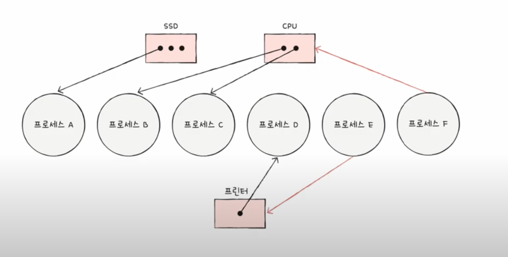
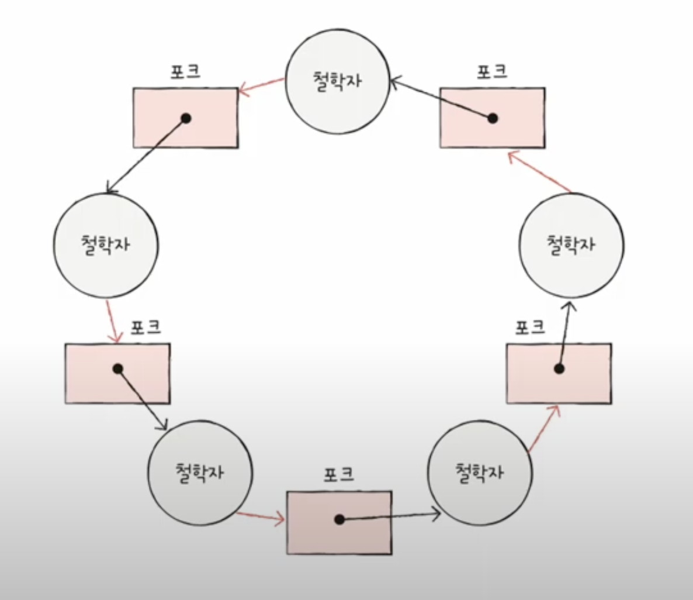

# Chap 13. 교착 상태

## 교착 상태란

두 개 이상의 프로세스가 각자 가지고 있는 자원을 무작정 기다린다면 그 어떤 프로세스도 더 이상 진행할 수 없게되는데 이를 `교착 상태`라고 함

### 1. 식사하는 철학자 문제

[식사하는 철학자 문제](https://www.youtube.com/watch?v=Kcv0_Yb8Rqw)  
결국엔 아무도 식사할 수 없게 됨  
일어나지 않을 사건들을 계속 기다리면서 진행이 멈추어 버리는 현상

> - 철학자 = 프로세스 / 스레드
> - 포크 = 실행에 꼭 필요한 자원
> - 식사 = 실행

[교착 상태 해결을 위해]

- 교착 상태가 발생했을 때의 상황을 정확히 표현하기
- 교착 상태가 일어나는 근본적인 이유에 대해 알기

### 2. 자원 할당 그래프

[자원 할당 그래프 규칙]

1. 프로세스는 원, 자원의 종류는 사각형으로 표현
2. 사용할 수 있는 자원의 개수는 자원 사각형 내에 점으로 표현
3. 프로세스가 어떤 자원을 할당받아 사용 중이라면 자원에서 프로세스를 향해 화살표 표시
4. 프로세스가 어떤 자원을 기다리고 있다면 프로세스에서 자원으로 화살표 표시

 
 

💡교착 상태가 일어난 자원 할당 그래프는 `원의 형태`  

### 3. 교착 상태 발생 조건

**[상호 배제]**  
한 프로세스가 사용하는 자원을 다른 프로세스가 사용할 수 없는 상태

**[점유와 대기]**  
자원을 할당 받은 상태에서 다른 자원을 할당 받기를 기다리는 상태

**[비선점]**  
어떤 프로세스도 다른 프로세스의 자원을 강제로 빼앗지 못하는 상태

**[원형 대기]**  
프로세스들이 원의 형태로 자원을 대기하는 상태

## 교착 상태 해결 방법

> - 예방 : 교착 상태 발생 조건에 부합하지 않게 자원을 분배
> - 회피 : 교착 상태가 발생하지 않을 정도로 조금씩 자원을 할당하다가 교착 상태의 위험이 있다면 자원을 할당하지 않는 방식으로 교착 상태 회피
> - 검출 후 회복 : 자원을 제약 없이 할당하다가 교착 상태 검출 시 교착 상태 회복

### 1. 교착 상태 예방

교착 상태 발생 필요 조건 네 가지 중 하나를 충족하지 못하게 하는 방법  
프로세스들에 자원을 할당 할 때 상호 배제, 점유와 대기, 비선점, 원형 대기 중 하나의 조건이라도 만족시키지 않게 할당하면 교착 상태 발생 X

- 자원의 상호 배제 제거
  모든 자원 공유 가능, 이론적으로 교착 상태 제거
  but, 현실적으로 모든 자원의 상호 배제를 없애기는 어렵기 때문에 현실 사용 다소 무리

- 점유와 대기 제거  
   운영체제는 특정 프로세스에 자원을 모두 할당하거나, 아예 할당하지 않는 방식으로 배분  
   이론적으로 교착 상태 해결 가능, 단점 존재

  - 자원의 활용률이 낮아질 우려
  - 많은 자원을 사용하는 프로세스가 불리해짐
  - **기아 현상** 야기할 우려

- 비선점 조건 제거  
   자원을 이용 중인 프로세스로부터 해당 자원 뺏기 가능  
   선점하여 사용할 수 있는 일부 자원에 대해서 효과적  
   but, 모든 자원이 선점 가능한 것 X  
   한 프로세스의 작업이 끝날 때까지 다른 프로세스가 기다려야 하는 자원도 있음(ex 프린터)  
   다소 범용성이 떨어짐

- 원형 대기 조건 제거  
   모든 자원에 번호를 붙이고, 오름차순으로 자원 할당  
   비교적 현실적이고 실용적인 방식  
   but, 모든 컴퓨터 시스템 내에 존재하는 수많은 자원에 번호를 붙이는 일은 쉽지 않음  
   각 자원에 붙는 번호에 따라 특정 자원 활용률이 떨어질 수 있음

## 2. 교착 상태 회피

교착 상태가 발생하지 않을 정도로만 조심 조심 자원 할당  
교착 상태 회피 방식에서는 교착 상태를 한정된 자원의 무분별한 할당으로 인해 발생하는 문제로 간주

**[안전 상태]**  
교착 상태가 발생하지 않고 모든 프로세스가 정상적으로 자원을 할당받고 종료될 수 있는 상태

**[안전 순서열]**  
교착 상태 없이 안전하게 프로세스들에 자원을 할당할 수 있는 순서를 의미  
안전 순서열이 있는 상태를 안전 상태라고 볼 수 있음

**[불안전 상태]**  
교착 상태가 발생할 수도 있는 상황  
안전 순수열이 없는 상황

### 3. 교착 상태 검출 후 회복

교착 상태 발생을 인정하고 사후에 조치하는 방식  
운영체제는 프로세스들이 자원을 요구할 때마다 그때그때 모두 할당하며, 교착 상태 발생 여부를 주기적으로 검사

[선점을 통한 회복]  
교착 상태가 해결될 때까지 한 프로세스씩 자원을 몰아주는 방식  
해결될 때까지 다른 프로세스로부터 자원을 강제로 빼앗고 한 프로세스에 할당

[프로세스 강제 종료를 통한 회복]  
가장 단순하면서 확실한 방식

- 교착 상태에 놓인 프로세스를 모두 강제 종료  
   교착 상태를 해결할 수 있는 가장 확실한 방식, but 많은 프로세스들이 작업 내역을 잃게 될 가능성
- 교착 상태가 없어질 때까지 한 프로세스씩 강제 종료
  작업 내역을 잃는 프로세스는 최대한 줄일 수 있지만 교착 상태가 없어졌는지 여부를 확인하는 과정에서 오버헤드 야기

[타조 알고리즘]  
교착 상태를 아예 무시하는 방법  
타조가 문제에 처했을 때 머리를 땅에 묻고 모른 체하는 모습에서 따 온 이름 (타조가 실제 그렇지는 않음;)
