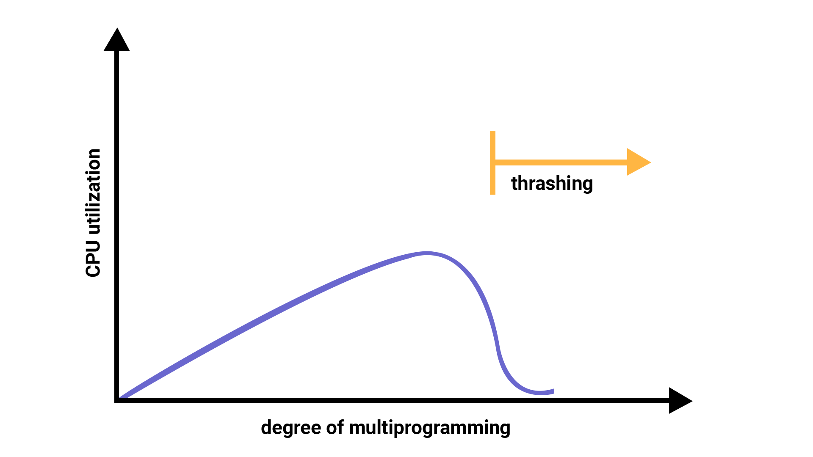

# Chap 14. 가상 메모리

## 페이지 교체와 프레임 할당

### 1. 요구 페이징

프로세스를 메모리에 적재할 때 처음부터 모든 페이지를 적재하지 않고 필요한 페이지만을 메모리에 적재하는 기법

> 1. CPU가 특정 페이지에 접근하는 명령어를 실행한다.
> 2. 해당 페이지가 현재 메모리에 있을 경우(유효 비트가 1일 경우) CPU는 페이지가 적재된 프레임에 접근한다.
> 3. 해당 페이지가 현재 메모리에 없을 경우(유효 비트가 0일 경우) 페이지 폴트가 발생한다.
> 4. 페이지 폴트 처리 루틴은 해당 페이지를 메모리로 적재하고 유효 비트를 1로 설정한다.
> 5. 다시 1번을 수행한다.

 

**순수 요구 페이징 기법**  
아무런 페이징도 메모리에 적재하지 않은 채 무작정 실행  
이 경우 프로세스의 첫 명령어를 실행하는 순간부터 페이지 폴트가 계속 발생  
실행에 필요한 페이지가 어느 정도 적재된 이후부터는 페이지 폴트 발생 빈도가 떨어짐

요구 페이징 시스템이 안정적으로 작동하기 위해서는 필연적으로 `페이지 교체`와 `프레임 할당` 문제를 해결해야함

**[페이지 교체 알고리즘]**  
메모리에 적재된 페이지 중에 어떤 페이지는 보조기억장치로 내보낼지 결정하는 방법  
일반적으로 페이지 폴트를 가장 적게 일으키는 알고리즘이 가장 좋은 알고리즘  
(페이지 폴트가 일어나면 보조기억장치로부터 필요한 페이지를 가져와야 하기 때문에 메모리에 적재된 페이지를 가져오는 것보다 느려짐)

💡 페이지 교체 알고리즘을 제대로 이해하기 위해서는 `페이지 폴트 횟수`를 알 수 있어야 함 !  
페이지 폴트 횟수는 `페이지 참조열`을 통해 알 수 있음

- 페이지 참조열 : CPU가 참조하는 페이지들 중 연속된 페이지를 생략한 페이지열을 의미  
   → 연속된 페이지를 생락하는 이유는 중복된 페이지를 참조하는 행위는 페이지 폴트를 발생시키지 않기 때문

**[FIFO 페이지 교체 알고리즘]**  
메모리에 가장 먼저 올라온 페이지부터 내쫓는 방식 (가장 단순한 방법)

- 아이디어와 구현이 간단
- 프로그램 실행 초기에 적재된 페이지 중 프로그램 실행 내내 사용될 내용을 포함한 페이지가 있을 수도 있기 때문에 이런 페이지는 먼저 적재되었다고 해서 먼저 빼내면 안됨

**[2차 기회 페이지 교체 알고리즘]**  
FIFO 페이지 교체 알고리즘의 문제점을 어느 정도 개선한 알고리즘  
FIFO 페이지 교체 알고리즘과 같이 기본적으로 메모리에서 가장 오래 머물렀던 페이지를 대상으로 내보낼 페이지를 선별  
차이는 만일 페이지의 참조 비트가 1일 경우, 당장 내쫓지 않고 참조 비트를 0으로 만든 뒤 현재 시간을 적재 시간으로 설정

**[최적 페이지 교체 알고리즘]**  
CPU에 의해 참조되는 횟수를 고려하는 페이지 교체 알고리즘  
보조기억장치로 내보내야 할 페이지는 아픙로 사용 빈도가 가장 낮은 페이지이므로 그 페이지를 내보내는 알고리즘  
but, 앞으로 오랫동안 사용되지 않을 페이지를 예측하기 어렵기 때문에 실제 구현이 어려움  
💡 그 자체를 운영체제에서 사용하기보다는, 주로 다른 페이지 교체 알고리즘의 이론상 성능을 평가하기 위한 목적으로 사용  
➡️ 최적 페이지 교체 알고리즘을 실행했을 때 발생하는 페이지 폴트 횟수를 페이지 폴트의 하한선으로 간주하고, 최적 페이지 교체 알고리즘에 비해 얼만큼 페이지 폴트 횟수가 발생하느냐를 통해 페이지 교체 알고리즘을 평가하기 위해 사용

**[LRU 페이지 교체 알고리즘]**  
가장 오랫동아 사용되지 '않은' 페이지를 교체하는 알고리즘  
'**최근에 사용되지 않은 페이지는 앞으로도 사용되지 않을 것**' 이라는 아이디어를 토대로 만들어진 알고리즘  
페이지마다 마지막으로 사용한 시간을 토대로 **최근에 가장 사용이 적었던** 페이지를 교체

### 2. 스래싱과 프레임 할당

페이지 폴트가 자주 발생하는 이유

- 나쁜 페이지 교체 알고리즘
- 프로세스가 사용할 수 있는 프레임 수가 적을 때(더 근본적인 이유)

- **스래싱**  
   프로세스가 실제 실행되는 시간보다 페이징에 더 많은 시간을 소요하여 성능이 저해되는 문제  
   지나치게 빈번한 페이지 교체로 인해 CPU 이용률이 낮아지는 문제

- 멀티프로그래밍의 정도  
   메모리에서 동시 실행되는 프로세스의 수

→ 동시에 실행되는 프로세스의 수(멀티프로그래밍의 정도)를 늘린다고 CPU 이용률이 그에 비례해서 증가하는 것이 아님을 나타내는 그래프

### 스레싱이 발생하는 근본적인 원인

→ 각 프로세스가 필요로 하는 최소한의 프레임 수가 보장되지 않았기 때문  
\* 각 프로세스들이 무리 없이 실행하기 위한 최소한의 프레임 수를 파악하고 프로세스들에 적절한 수만큼 프레임을 할당해 줄 수 있어야 함

[프레임 할당 방식]

- 균등 할당 : 모든 프로세스에 균등하게 프레임 제공  
   실행되는 프로세스들의 크기가 다 다른데 동일한 프레임 개수를 할당하는 것은 비합리적
- 비례 할당 : 프로세스의 크기에 따라 프레임 제공  
  \* 균등 할당과 비례 할당 방식은 프로세스의 실행 과정을 고려하지 않고 단순히 프로세스의 크기와 물리 메모리의 크기만을 고려한 방식이라는 점에서 **정적 할당 방식**

[프로세스를 실행하는 과정에서 배분할 프레임을 결정하는 방식]

- 작업 집합 모델 : 프로세스가 일정 기간 동안 참조한 페이지 집합을 기억하여 빈번한 페이지 교체를 방지
  > 작업 집합 : 실행 중인 프로세스가 일정 시간 동안 참조한 페이지의 집합
- 페이지 폴트 빈도

  1. 페이지 폴트율이 너무 높으면 그 프로세스는 너무 적은 프레임을 갖고 있다
  2. 페이지 폴트율이 너무 낮으면 그 프로세스가 너무 많은 프레임을 갖고 있다

  페이지 폴트율에 **상한선과 하한선을 정하고**, 이 범위 안에서만 프레임을 할당하는 방식

 

# Chap 15. 파일 시스템

## 파일과 디렉터리

### 1. 파일

하드 디스크나 SSD와 같은 보조기억장치에 저장된 관련 정보의 집합을 의미  
→ 파일은 의미 있고 관련 있는 정보를 모은 논리적 단위

모든 파일에는 이름과 파일을 실행하기 위한 정보, 파일 관련 부가정보가 존재

- **속성(메타데이터)** → 파일의 부가 정보

[파일 속성과 유형]  
대표적인 속성의 종류  
유형, 크기, 보호, 생성 날짜, 마지막 접근 날짜, 마지막 수정 날짜, 생성자, 소유자, 위치 ...

- 파일 유형 : 운영체제가 인식하는 파일 종류  
   파일에 확장자를 붙여주는 방식으로 구분

[파일 연산을 위한 시스템 호출]  
파일을 다루는 모든 작업은 운영체제에 의해 이뤄짐  
→ 운영체제는 시스템 호출을 제공

1. 생성
2. 삭제
3. 열기
4. 닫기
5. 읽기
6. 쓰기

### 2. 디렉터리

파일들을 일목요연하게 관리하기 위해 이용  
윈도우에서는 폴더라고 부름

- 1단계 디렉터리 : 운영체제에 하나의 디렉터리만 존재하는 것
- 2단계 디렉터리 : 여러 계층의 디렉터리가 존재  
   최상위 디렉터리, 그 아래에 여러 서브 디렉터리(지식 디렉터리)
  > **루트 디렉터리** = 최상위 디렉터리 → /(슬래시)로 표현  
  > 경로 : 디렉터리를 이용해 파일 위치, 파일 이름을 특정 짓는 정보  
  > \* 윈도우 운영체제에ㅓㅅ 최상위 디렉터리는 흔히 C:₩로 표현

[절대 경로와 상대 경로]  
같은 디렉터리에는 동일한 이름의 파일이 존재할 수 없고, 서로 다른 디렉터리에서는 가능

- 절대 경로 absolute path  
   모든 파일이 가진 루트 디렉터리에서 자기 자신까지 이르는 고유한 경로

- 상대 경로 relative path  
   현재 디렉터리부터 시작하는 경로

[디렉터리 연산을 위한 시스템 호출]  
운영체제는 디렉터리 연산을 위한 시스템 호출도 제공

1. 생성
2. 삭제
3. 열기
4. 닫기
5. 읽기

[디렉터리 엔트리]  
많은 운영체제에서 디렉터리를 그저 '특별한 형태의 파일'로 간주  
즉, 디렉터리도 파일 !!

> 파일 : 내부에 해당 파일과 관련된 정보를 담고 있음  
> 디렉터리 : 내부에 해당 디렉터리에 담겨 있는 대상과 관련된 정보를 담고 있음

디렉터리는 보조기억장치에 **테이블 형태의 정보**로 저장  
디렉터리 엔트리(행)이 공동으로 포함하는 정보  
→ 디렉터리에 포함된 대상의 이름과 그 대상이 보조기억장치 내에 저장된 위치를 유추할 수 있는 정보  
디렉터리 엔트리만 봐도 해당 디렉터리에 무엇이 담겨 있는지, 어디에 담겨있는지 직간접적으로 알 수 있음
