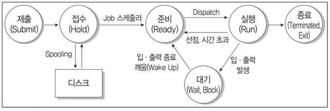
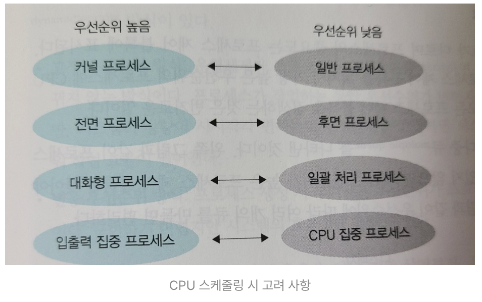

# CPU 스케줄링

- 어떤 작업에 CPU를 배정할지 결정하는 것

→ 컴퓨터 시스템 효율은 어떤 프로세스에 CPU를 먼저 배정하느냐에 따라 달라지므로 **CPU 스케줄링은 작업의 형평성과 효율성을 결정**하는 중요한 일

**[규모에 따라 구분]**

- 장기 스케줄링 (Long-term scheduler)  
   시스템 내의 **전체 작업 수**를 조절  
   어떤 작업을 시스템이 받아들일지 또는 거부할지 결정  
   시스템 내에서 동시에 실행 가능한 **프로세스의 총 개수가 정해짐**  
   \* 최근 운영체제에서는 보통 장기 스케줄러가 없고, 프로그램을 실행시키면 곧바로 ready 상태 돌입

- 중기 스케줄링(Medium-term scheduler, Swapper)  
   고수준 스케줄링 과정에서 여러 가지 사정으로 시스템 과부하가 걸리는 경우가 있음  
   → 시스템의 과부하를 막기 위해 활성화된 프로세스들의 중지 여부를 결정하여 활성화된 프로세스 수를 조절  
   **중지(suspend)와 활성화(active)**  
   여유 공간 마련을 위해 프로세스를 통째로 메모리에서 디스크로 swap out  
   이 때, 이미 활성화된 프로세스 중 일부를 `보류 상태`로 보냄(중지된 프로세스들)

- **단기 스케줄링(Short-term scheduler, CPU scheduler)**  
   활성화된 프로세스를 준비 상태로 보낼지, 실행 상태로 보낼지, 대기 상태로 보낼지 결정  
   → 사실상 실제로 작업이 이루어지는 스케줄링  
   어떤 프로세스에 CPU를 할당할지, 어떤 프로세스를 대기 상태로 보낼지 등을 결정  
   💡 단기 스케줄러가 어떤 기준에 따라 프로세스를 선택(스케줄링 알고리즘)하고 어느 정도 자원을 배분할지에 따라 시스템에 큰 영향  
   

**[CPU 스케줄링의 목적]**

- **공평성** : 모든 프로세스가 자원을 공평하게 배정받아야 한다.
- **효율성** : 시스템 자원이 유휴 시간 없이 사용되도록 스케줄링해야 하고 유휴 자원을 사용하려는 프로세스에는 우선권을 주어야 한다.
- **안정성** : 중요 프로세스의 우선순위를 높여 먼저 작동하도록 배정함으로써 시스템 자원을 점유하거나 파괴하려는 프로세스로부터 자원을 보호해야 한다.
- **확장성** : 프로세스가 증가해도 시스템이 안정적으로 작동하도록 조치해야 한다.
- **반응 시간 보장** : 시스템은 적절한 시간 안에 프로세스의 요구에 반응해야 한다.
- **무한 연기 방지** : 특정 프로세스의 작업이 무한히 연기되어서는 안된다.

### CPU 스케줄러

**[Dispatcher]**  
CPU의 제어권을 CPU 스케줄러에 의해 선택된 프로세스에게 넘겨주는 모듈  
→ 일종의 문맥 교환을 수행하는 모듈

> 문맥 교환 (Context Switch)  
> 어떤 프로세스를 사용 중인 상태에서 다른 프로세스를 사용하기 위해 이전의 프로세스 상태를 보관하고 새로운 프로세스의 상태를 적재하는 작업

디스패처는 한 프로세스에서 다른 프로세스로 문맥 교환 + 커널 모드에서 유저 모드로 변경하는 기능  
\* Dispatcher는 최대한 빨라야 함!  
 

**[프로세스 우선순위]**  
운영체제의 두 가지 프로세스

- **커널 프로세스**  
  운영체제의 핵심 기능을 수행하기 위한 프로세스  
  시스템 안정성 + 보안 유지 역할  
  → 일반 프로세스보다 높은 우선순위, 우선 처리

- **일반 프로세스**  
  사용자가 실행하는 일반적인 프로그램  
  사용자의 요청에 따라 실행, 작업 수행  
  → 커널 프로세스보다 낮은 우선순위, 느리게 처리될 수 있음

 

**[CPU/IO Bound Process]**

- CPU bound process  
   CPU 리소스를 많이 사용하는 프로세스  
   일반적으로 계산 작업 많은 경우 (ex. 알고리즘 계산, 데이터 처리 ..)  
   → 우선순위가 높게 설정될 수 있음

- IO boung process  
  주로 입출력 작업을 많이 하는 프로세스 의미  
  주로 디스크나 네트워크 같은 입출력 리소스를 사용하는 작업 수행  
  → 우선순위가 상대적으로 낮게 설정될 수 있음

운영체제는 CPU bound process와 IO bound process에 대한 우선순위를 적절히 조절하여 시스템의 성능과 안정성 유지

 

**[스케줄링 알고리즘 평가 기준]**
| 항목 | 설명 | 목표 |
|---------------------|----------------------------------------------------------|-------|
| **CPU 사용률** (CPU Utilization) | 전체 시스템 시간 중 CPU가 작업을 처리하는 시간의 비율 | **최대화** |
| **처리량** (Throughput) | CPU가 단위 시간당 처리하는 프로세스의 개수 | **최대화** |
| **반환시간**★ (Turnaround Time) | 프로세스가 시작해서 끝날 때까지 걸리는 시간 | **최소화** |
| **대기시간**★★ (Waiting Time) | 프로세스가 준비 큐(Ready Queue)에서 대기한 시간의 총합 | **최소화** |
| **응답시간** (Response Time) | 요청 후 응답이 오기 시작할 때까지의 시간 | **최소화** |

> 대기 시간 = 마지막 작업 시작 시간 - 도착 시간  
> 반환 시간 = 작업 종료 시간 - 도착 시간

 

---

## 참고자료

- [CPU 스케줄링\_1](https://kjhoon0330.tistory.com/m/entry/%EC%9A%B4%EC%98%81%EC%B2%B4%EC%A0%9COS-CPU-%EC%8A%A4%EC%BC%80%EC%A4%84%EB%A7%81)
- [CPU 스케줄링\_2](https://rob-coding.tistory.com/311)
- [CPU 스케줄링\_3](https://velog.io/@yu-jin-song/OS-CPU-%EC%8A%A4%EC%BC%80%EC%A4%84%EB%A7%81CPU-Scheduling)
