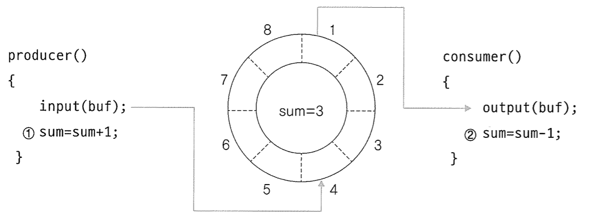

# 프로세스 동기화 Process Synchronization

멀티 프로세스, 멀티 스레드 환경에서는 한정된 자원을 가지고 공동으로 작업 수행 가능  
! 이 경우 문제 발생 가능

- 경쟁 상태  
  2개 이상의 프로세스나 스레드가 공유 자원을 병행해서 읽거나 쓰는 상황

  > 공유 자원 = 여러 프로세스나 스레드가 공동으로 이용하는 변수, 메모리, 파일  
  > 레이스 컨디션 = 잘못된 실행으로 인해 여러 프로세스가 동시 다발적으로 임계 구역의 코드를 실행하여 문제가 발생하는 경우

      공유자원은 공동으로 이용되기 때문에 누가 언제 데이터를 읽거나 쓰느냐에 따라 결과가 달라질 수 있음
      **→ 데이터 불일치 Data Inconsistency**

➡️ 동기화는 **경쟁 상태를 막고 데이터 일관성을 유지**하기 위해서 프로세스 간의 실행 순서를 정해주는 매커니즘

- 임계 구역  
   코드 상에서 경쟁 상태가 일어날 수 있는 특정 부분
  > **생산자-소비자 문제(Producer-Consumer Problem)**  
  > 
  > 생산자 - 물건 생성 후 버퍼에 삽입  
  > 소비자 - 버퍼에서 물건 추출  
  > 버퍼에 물건 양을 확인하는 변수 sum  
  > 생산자와 소비자가 서로 sum 값에 접근해서 sum이 변경되는 시점에 접근 순서를 처리하지 않으면 결과가 예상치 못하게 바뀔 수 있음
  > '총합' 이라는 공유 자원을 동시에 접근하면서 문제 발생  
  > → sum의 값을 조작하려는 부분이 **임계구역**

 

**[임계 구역 문제 해결 방법]**

1. 상호 배제 Mutal Exclusion  
   한 프로세스/스레드가 임계 구역에 들어가면 다른 프로세스/스레드는 임계 구역 진입 불가
2. 한정 대기 Bounded Waiting  
   어떤 프로세스/스레드도 임계 영역에서 무한 대기하는 상황이 발생하지 않게 한다. (기아 상태 해결)
3. 진행의 융통성 Progress Flexibility  
   임계 구역에 어떤 프로세스도 진입하지 않았다면 임계 구역에 진입하고자 하는 프로세스는 들어갈 수 있어야 한다. (교착 상태 해결)

   ➡️ 임계 구역 문제를 해결하는 단순한 방법은 **잠금(Lock)을 이용**하는 것  
   임계 구역에 들어가기 전 해당 구역 진입 지점을 잠그고, 임계 구영에서 작업이 끝나면 잠금을 해제하는 방식

 

**[임계 구역 문제 해결 알고리즘]**

- **검사와 지정(test-and-set)**  
   상호배제와 한정 대기 조건을 충족시키는 방법  
   하드웨어에서 제공하는 특별한 명령 사용, 공유 변수(lock)을 조작하는 방식  
   testandset(&lock) → 현재 변수 값을 읽음(검사), lock 변수에 true 설정(지정)  
   \* 효율성 문제 → 대기 중인 프로세스가 while(testandset) 루프에서 CPU를 계속 사용하면서 반복적으로 lock 상태 확인 → CPU 리소스 낭비  
   \* 세마포어를 이용하는 것이 더 효율적 !

- **피터슨 알고리즘**  
   프로세스가 자신만의 lock 변수로 임계 구역을 통과할 수 있게 하고 turn 변수로 어떤 프로세스가 현재 임계 구역에 들어왔는지 알려주는 방법  
   단점 : 2개의 프로세스만 사용 가능하다는 한계

- **데커 알고리즘**  
   임계 구역에 진입하기 위한 프로세스 고유의 lock 변수가 존재하고, turn 변수를 사용하여 현재 어떤 프로세스가 임계 구역에 접근해야 하는지 지정  
   단점 : 프로세스가 늘어나면 변수도 늘어나고 전체 알고리즘도 복잡해짐

[참고 자료]  
[동기화](https://rob-coding.tistory.com/29)  
[뮤텍스 락](https://nomad-programmer.tistory.com/114)
